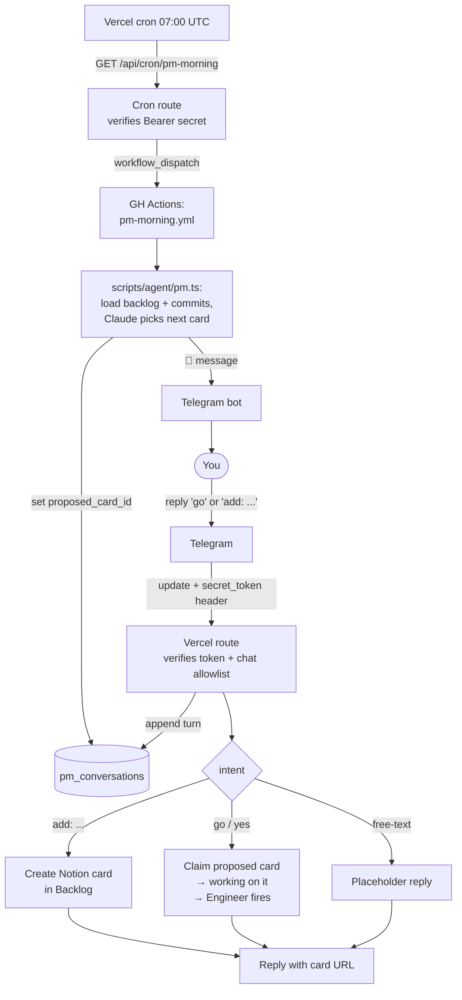

# Setting up an autonomous Engineer agent for your project

A portable guide for replicating this repo's Engineer-agent setup in
another project. Written in plain English — read it top to bottom, then
follow the steps in order.

---

## What you're building

A loop where you drop tasks into a Notion kanban and code shows up as
GitHub pull requests, without you clicking anything in between.

1. You move a card from **Backlog** to **"working on it"** in Notion.
2. Notion fires a webhook to your Vercel app.
3. The Vercel app pokes a GitHub Actions workflow.
4. GitHub Actions runs Claude Code inside a sandboxed Ubuntu runner.
5. The agent reads your project's docs, writes a plan, implements the
   change, runs your tests, opens a pull request, and tells you on
   Telegram.

You stay in the loop at exactly two points: writing the card, and
reviewing/merging the PR.

There's also an **optional PM layer**: a small agent that runs once a
day, reviews the backlog, proposes the next card on Telegram, and waits
for you to reply `go` before any code runs. See
[Inbound Telegram + PM agent](#inbound-telegram--pm-agent-optional)
below. Skip it if you'd rather pick cards yourself.

```mermaid
flowchart TD
    You([You]) -->|move card to<br/>"working on it"| Notion[(Notion kanban)]
    Notion -->|webhook| Vercel[Vercel route<br/>verifies signature]
    Vercel -->|dispatch| Poller[GH Actions:<br/>Engineer Poller]
    Poller --> Busy{Engineer<br/>already running?}
    Busy -->|yes| Skip[Skip — next event<br/>will pick it up]
    Busy -->|no| Engineer[GH Actions:<br/>Engineer]
    Engineer --> Read[Read project docs<br/>+ Notion card]
    Read --> Plan[Write .agent/plan.md<br/>plain English + technical]
    Plan --> Block{Plan contains<br/>BLOCKING question?}
    Block -->|yes| Park1[Park card to Backlog<br/>🟡 Telegram with plan]
    Block -->|no| Impl[Implement code]
    Impl --> Verify{lint + typecheck<br/>+ e2e pass?}
    Verify -->|no, after retry| Park2[Park card<br/>🔴 Telegram + work artifact]
    Verify -->|yes| Decisions[Write .agent/decisions.md<br/>plain English + technical]
    Decisions --> PR[Open PR<br/>body = decisions.md]
    PR --> Done[Move card to Review<br/>🟢 Telegram with summary]
    Park1 --> You
    Park2 --> You
    Done --> You
```

---

## Prerequisites

Free tiers are enough for everything except Notion, where you need a
workspace with API/webhook access (Free plan works).

- A GitHub repo for your project.
- A Vercel project linked to that repo (free Hobby plan is fine).
- A Notion workspace + a kanban database with a **Status** column whose
  values include `Backlog`, `working on it`, `Review`, `Done`.
- A Notion integration (notion.so/my-integrations) with access to the
  kanban database.
- A Telegram bot (via `@BotFather`) and the chat ID where it should
  send messages.
- An Anthropic API key (Claude Code CLI uses this).
- A GitHub Personal Access Token with `repo` + `workflow` scopes (you
  need a PAT, not the default `GITHUB_TOKEN`, so PRs created by the
  agent trigger your CI/preview builds).

---

## The pieces, in plain English

| Piece | Lives at | What it does |
|---|---|---|
| **Backlog adapter** | `scripts/agent/backlog.ts` | Talks to Notion. Lists cards, claims them, sends them to Review, parks them back to Backlog. |
| **Notifier** | `scripts/agent/notify.ts` | Sends Telegram messages with 🟢 🟡 🔴 🔵 prefixes. |
| **Engineer orchestrator** | `scripts/agent/engineer.ts` | Builds the prompt for Claude Code, runs it, then runs the verify suite (lint + typecheck + e2e). One retry on verify failure. |
| **Engineer workflow** | `.github/workflows/engineer.yml` | The GH Actions runner. Checks out, installs deps, runs the orchestrator, opens a PR, moves the card, pings Telegram. Handles failure paths. |
| **Poller** | `scripts/agent/poller.ts` + `.github/workflows/engineer-poller.yml` | Reads Notion for "working on it" cards, checks if Engineer is busy, dispatches Engineer if idle. Runs on cron *and* on demand. |
| **Notion webhook receiver** | `src/app/api/webhook/notion/route.ts` | Listens for Notion events on Vercel, filters out noise (comments etc.), pokes the poller via the GitHub API. |
| **Telegram webhook receiver** *(optional)* | `src/app/api/webhook/telegram/route.ts` | Listens for messages you send to the bot. Understands `add: <title>` (creates a card) and `go` / `yes` (claims the PM-proposed card and dispatches the Engineer). |
| **Conversation state** *(optional)* | `pm_conversations` table + `src/lib/pm-conversations.ts` | Postgres table storing the open Telegram thread, transcript, and the card the PM has proposed. |
| **PM agent** *(optional)* | `scripts/agent/pm.ts` + `.github/workflows/pm-morning.yml` + `src/app/api/cron/pm-morning/route.ts` | Daily Vercel cron pokes a GH Actions workflow that runs the PM script. The script reads the backlog + recent commits, asks Claude to pick the next card with a short reason, sends a 🔵 Telegram message, and persists the `proposed_card_id`. |

---

## Setup steps, in order

### 1. Wire up the four services

- **GitHub PAT.** Create one at github.com/settings/tokens with `repo`
  + `workflow` scopes. Save it as a repo secret named `AGENT_GH_TOKEN`.
- **Notion integration.** Create one, give it read+write access to the
  kanban database. Copy the integration token and the database ID
  (from its URL).
- **Telegram bot.** Talk to `@BotFather`, create a bot, save the token.
  Send your bot any message, then visit
  `https://api.telegram.org/bot<TOKEN>/getUpdates` to find your chat
  ID.
- **Anthropic key.** Get one from console.anthropic.com.

### 2. Add the repo secrets

In **GitHub → Settings → Secrets and variables → Actions**, add:

| Secret | Value |
|---|---|
| `AGENT_GH_TOKEN` | The PAT from step 1 |
| `ANTHROPIC_API_KEY` | Your Anthropic key |
| `NOTION_TOKEN` | Notion integration token |
| `NOTION_BACKLOG_DB_ID` | Notion database ID |
| `TELEGRAM_BOT_TOKEN` | Telegram bot token |
| `TELEGRAM_CHAT_ID` | Your chat ID |

Plus any secrets your verify suite needs (database URL, test user
credentials, etc.).

### 3. Copy the scripts and workflows

From this repo, copy these files into your new project:

- `scripts/agent/backlog.ts`
- `scripts/agent/notify.ts`
- `scripts/agent/engineer.ts`
- `scripts/agent/poller.ts`
- `.github/workflows/engineer.yml`
- `.github/workflows/engineer-poller.yml`
- `src/app/api/webhook/notion/route.ts`

Adjust `engineer.ts` so the prompt mentions YOUR project's mandatory
reading list (CLAUDE.md, your decisions log, your patterns doc, etc.)
and the "do not touch" list reflects YOUR repo's structure.

Adjust `engineer.yml`'s verify step list to match your project's
actual scripts (`lint`, `typecheck`, `test`, whatever you have).

### 4. Configure the Notion webhook on Vercel

- Set Vercel env vars (Production scope) and redeploy:
  - `NOTION_WEBHOOK_SECRET` — fill in step 5 below.
  - `AGENT_GH_TOKEN` — same PAT as the GH Actions secret.
- Update the `GH_REPO` constant in
  `src/app/api/webhook/notion/route.ts` to your repo's `owner/name`.

### 5. Subscribe Notion to the webhook

- In your Notion integration settings → Webhooks → new subscription.
- URL: `https://<your-vercel-domain>/api/webhook/notion`.
- Subscribe to: page property changes on the kanban database.
- Notion sends a verification token; check Vercel logs for a line
  starting `[notion-webhook] verification_token=`. Paste it back into
  Notion's confirmation field.
- Notion shows a signing secret after verification. Paste it into
  Vercel as `NOTION_WEBHOOK_SECRET`. Redeploy.

### 6. Smoke-test

- Add a card to Backlog with clear acceptance criteria.
- Move it to "working on it".
- Within seconds you should see a 🔵 Telegram ping ("Engineer auto-
  dispatched").
- ~10–30 minutes later, 🟢 (PR ready), 🟡 (questions), or 🔴 (failed).
- If nothing fires, manually trigger the Engineer Poller workflow in
  the GitHub Actions UI to bypass the webhook and confirm the rest of
  the chain works.

---

## Inbound Telegram + PM agent (optional)

This is a small, optional layer with two parts:

- **Inbound Telegram**: the same bot already sending you 🟢 🟡 🔴 pings
  now also listens. Text `add: pay the AWS bill` from your phone and a
  card appears in Backlog within a second.
- **PM morning agent**: a daily cron picks the top backlog card,
  explains why on Telegram, and waits for you to reply `go`. When you
  do, the inbound webhook claims the card and the Engineer fires.



### Setup

**1. Apply the migration.** Create the `pm_conversations` table:

```bash
psql "$DATABASE_URL" -f db/migrations/0007_pm_conversations.sql
```

Or paste the contents into Supabase SQL Editor.

**2. Set the webhook secret in Vercel** (Production scope, then redeploy):

```bash
openssl rand -hex 32   # generate a secret
```

Add to Vercel as `TELEGRAM_WEBHOOK_SECRET`. `TELEGRAM_BOT_TOKEN` and
`TELEGRAM_CHAT_ID` are already set if outbound notifications work.
`DATABASE_URL` must be present too (it is, if the rest of the app works).

**3. Register the webhook with Telegram:**

```bash
curl -X POST "https://api.telegram.org/bot${TELEGRAM_BOT_TOKEN}/setWebhook" \
  --data-urlencode "url=https://<your-vercel-domain>/api/webhook/telegram" \
  --data-urlencode "secret_token=${TELEGRAM_WEBHOOK_SECRET}" \
  --data-urlencode 'allowed_updates=["message","edited_message"]'
```

**4. Verify:**

```bash
curl "https://api.telegram.org/bot${TELEGRAM_BOT_TOKEN}/getWebhookInfo"
```

You want `"url"` set to your route and no `last_error_message` after
the next real delivery.

**5. Smoke test:** text the bot `add: smoke test`. Within a second a
card titled "smoke test" appears in Notion Backlog and the bot replies
with its URL.

### What it understands today

| You text | Bot does |
|---|---|
| `add: <title>` | Creates a Notion card in Backlog, replies with URL |
| `go` / `yes` / `ok` | Claims the PM-proposed card → Engineer fires |
| anything else | Logs the turn, replies with a placeholder |

### Wiring up the PM morning agent

The PM script lives in `scripts/agent/pm.ts`. It's a one-shot
synthesis: load backlog + recent commits → ask Claude to pick the
next card with a one-paragraph reason → send a 🔵 Telegram message
→ persist `proposed_card_id` in `pm_conversations`. When you reply
`go`, the inbound webhook from above does the rest.

**1. GH Actions workflow** — `.github/workflows/pm-morning.yml`
exposes `workflow_dispatch` and reuses the existing `ANTHROPIC_API_KEY`
and `DATABASE_URL` secrets that the Engineer workflow already needs.
No new secrets required.

**2. Vercel cron route** — `src/app/api/cron/pm-morning/route.ts`
authenticates via `Authorization: Bearer $CRON_SECRET` (Vercel sets
this) and dispatches the workflow via the GitHub API. Update the
`GH_REPO` constant to your repo.

**3. Register the cron** in `vercel.json`:

```json
{ "path": "/api/cron/pm-morning", "schedule": "0 7 * * *" }
```

`0 7 * * *` is daily at 07:00 UTC — approximately 09:00 Berlin time
(08:00 in winter). Vercel cron schedules are always UTC. **Hobby plan
limit:** daily-only crons; if you want a different time of day pick
one schedule per day. Pro plan unlocks sub-daily crons.

**4. Smoke test:**

```bash
npx tsx --env-file=.env.local scripts/agent/pm.ts
```

You should see a 🔵 Telegram message proposing a card. Reply `go` —
within seconds the Engineer should fire on that card.

### To remove later

```bash
curl -X POST "https://api.telegram.org/bot${TELEGRAM_BOT_TOKEN}/deleteWebhook"
```

The route stays deployed but Telegram stops calling it.

---

## Decisions made — and why

These are the design choices in this implementation. If you skip or
change one of these, do it on purpose — each was a response to a
specific problem.

### Two-layer triggering: webhook + cron fallback

The Notion webhook is the primary trigger. A GitHub Actions cron runs
every 30 minutes as a safety net. **Why:** webhooks fail occasionally
(Vercel down, secret rotated, Notion beta change). A cron fallback
means the agent eventually picks up the card even if every webhook for
a day was missed. Cron alone is too slow — GH Actions free-tier cron
fires every 1–4 hours in practice.

### Poller in the middle, not webhook → Engineer directly

The webhook doesn't fire the Engineer directly. It pokes the **Engineer
Poller**, which then checks state and dispatches the Engineer if
appropriate. **Why:** the poller has one job — look at Notion, decide
whether to fire the Engineer. Whether the trigger came from a webhook,
a cron tick, or a manual button click, the logic is identical. This
keeps the decision in one place.

### Only one Engineer running at a time

Both the poller (workflow concurrency group `engineer-poller`) and the
Engineer (`engineer-agent`) serialize their runs at the GH Actions
level. **Why:** the agent edits the working tree. Two agents writing
to the same files would corrupt each other's work. Serialization is
cheap; safety is the goal.

### Plan before code, in plain English

The Engineer is required to write `.agent/plan.md` BEFORE editing any
code. The file has six sections, including a required "In plain
English (no jargon)" paragraph. If the plan contains a question
starting with **BLOCKING:**, the agent exits without changes and the
question is forwarded via 🟡 Telegram. **Why:** the first real
dispatch on this repo deleted 1,629 lines because nobody could see the
agent's reasoning before the diff landed. Now reasoning is a
first-class artifact, and the agent has an explicit "exit and ask"
path instead of guessing.

### Decisions after code, also in plain English

After the work is done, the Engineer writes `.agent/decisions.md` with
what changed, why, judgment calls, what was NOT done, and risks. This
file becomes the PR body. The 🟢 Telegram ping leads with its plain-
English paragraph. **Why:** PR boilerplate is useless. The reviewer
needs to know what the agent thought it was doing and what it
deliberately left alone. The audit trail lives where reviewers
actually look.

### Move the card on every exit, no matter what

On success the card goes to Review. On failure, no-op, or BLOCKING
questions, the card goes back to Backlog. **Why:** the first version
left failed cards in "working on it", and the poller re-fired the
same broken run every cycle. Always exit the in-progress state. You
re-move the card when you want a retry — that's an explicit human
signal.

### Upload work-in-progress on failure

On any workflow failure, the full `.agent/` directory plus a `git
diff` patch of every uncommitted change is uploaded as a GH Actions
artifact (90-day retention). **Why:** mechanical failures (shell-
quoting bugs, flaky tests) were wasting 10+ minutes of token spend.
The artifact lets you salvage 90% of the work without paying for a
full re-run.

### Pass user-provided strings via env vars in workflow shell

Card titles can contain quotes, dollar signs, backticks — anything.
Every `${{ steps.X.outputs.Y }}` that lands in shell commands is
routed through an `env:` block first, so the shell can't reinterpret
the content. **Why:** a card titled `Merge "A" + "B"` broke `git
commit -m "agent: ..."` and killed an otherwise-successful run.

### Telegram webhook uses `secret_token`, not HMAC

The Notion webhook verifies an HMAC signature over the raw body; the
Telegram one just compares the `X-Telegram-Bot-Api-Secret-Token`
header to an env var. **Why:** Telegram doesn't sign payloads — its
designed-in auth mechanism is the secret token you set when calling
`setWebhook`. The token is bot-scoped and rotatable. We also keep a
chat-ID allowlist as a second cheap check so a leaked token can't be
used to post messages from a different chat.

### Filter Notion webhook events

The webhook receiver skips comment events, user events, workspace
events, and any unknown event type. **Why:** writing a comment on a
card shouldn't fire the Engineer. Default-skipping unknown types
means a future Notion beta change can't accidentally flood the poller.

### "Plain English" is a hard requirement, not a hint

Both plan.md and decisions.md have a required "In plain English (no
jargon)" section at the top. The prompt rule says: "No code
identifiers, no acronyms without expansion, no internal jargon." **Why:**
the goal is that any non-engineer can read the first paragraph of
any PR or Telegram ping and understand what changed. Documentation
that needs an engineer to translate isn't documentation.

---

## What's intentionally NOT in this setup

To keep scope honest, these are things you might expect but won't find:

- **No mid-task conversation with the Engineer.** Even with inbound
  Telegram wired up, the Engineer cannot pause mid-task and ask a
  question. It either makes a clean decision or exits before editing.
  Resume-on-reply is a future slice.
- **The inbound channel only handles `add:` and `go`.** Free-text gets
  a placeholder reply — there's no LLM behind the conversation itself
  yet. The PM agent runs once a day as a one-shot synthesis, not as
  an ongoing back-and-forth.
- **No conversational PM.** The morning thread is one message ("I
  propose X because Y. Go?"). You reply `go` or move a different card
  yourself. The PM doesn't iterate vague ideas into sharp acceptance
  criteria — you still write the cards.
- **No PM agent.** There's no agent that talks to you in the morning,
  reviews backlog, or proposes priorities. You write the cards
  yourself.
- **No quality eval.** The verify suite catches syntax/type/integration
  failures. It doesn't grade the agent's judgment. If the agent picks
  a bad approach but the code still passes lint, you find out at PR
  review.
- **No parallel Engineers.** One card at a time. Multiple cards in
  "working on it" process FIFO over successive triggers.
- **No automatic retry on failure.** Failed cards go to Backlog. You
  decide whether to re-move them, edit the card, or close it.

---

## Cost shape

Per Engineer run, in rough numbers:

- **Claude Code (Opus 4.7):** $1–5 of tokens for a typical small change.
  Bigger changes can cost more.
- **GitHub Actions minutes:** 5–15 minutes per run. Free tier is
  2,000 minutes/month on private repos, unlimited on public.
- **Vercel:** the webhook route is a normal serverless function call;
  effectively free at this volume.
- **Notion + Telegram:** free.

The bulk of cost is Claude tokens. The agent reads several files at
the start of every run (your CLAUDE.md, decisions log, patterns doc,
state snapshot, plus the card) and that read cost compounds. If runs
get expensive, tighten the prompt or use prompt caching.

---

## When to revisit this design

- **If you outgrow one-at-a-time.** Multiple parallel Engineers need
  per-card branches that don't conflict and a different concurrency
  model. The current setup intentionally avoids this until you have
  evidence you need it.
- **If quality drops.** Add an eval suite (golden inputs + scored
  outputs) before scaling concurrency.
- **If you want the PM to converse, not just announce.** Today the
  morning thread is one-shot: it proposes, you reply `go` or move a
  different card yourself. A conversational PM would let you text back
  "do Y instead" or "wait — what's the rationale on X?" and have the
  LLM iterate. That's an extension of the free-text branch in the
  inbound webhook.
- **If you want the Engineer to resume after a 🟡 question.** Today
  the Engineer exits and parks the card when it hits a BLOCKING
  question. A resume path would let your Telegram reply re-dispatch
  the workflow with the answer appended — same plumbing as the
  inbound webhook, different intent handler.

---

Source repo for the reference implementation:
https://github.com/nickybricks/agent-hub (private). The
[`.github/AGENTS.md`](../.github/AGENTS.md) file documents the same
system from the operator's perspective rather than the implementer's.
