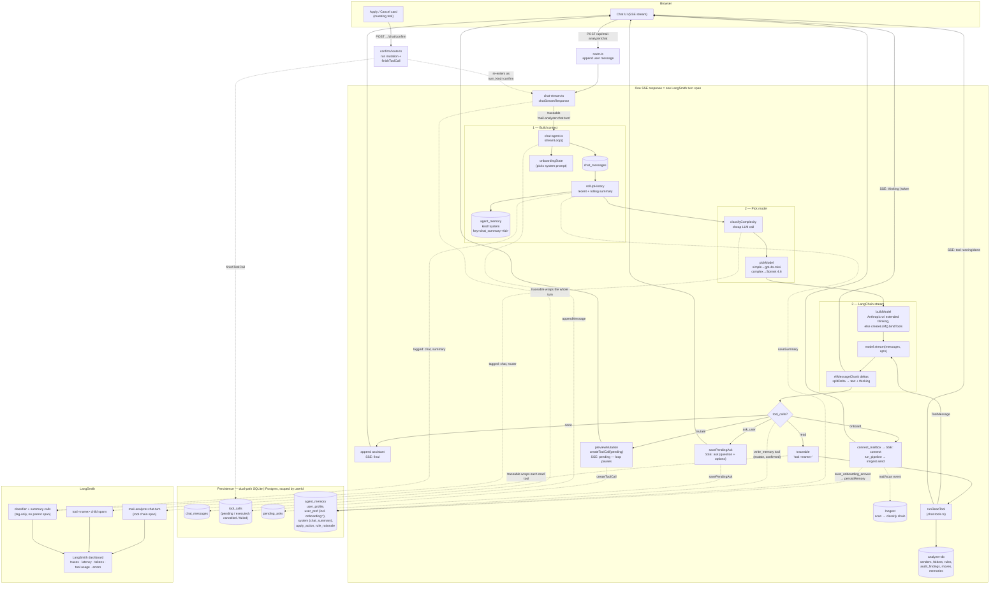

# Chat agent — tools, LangChain, LangSmith, memory

How one chat turn flows through [`src/lib/chat-stream.ts`](../src/lib/chat-stream.ts)
+ [`src/lib/chat-agent.ts`](../src/lib/chat-agent.ts) +
[`src/lib/chat-tools.ts`](../src/lib/chat-tools.ts): where LangChain runs,
where LangSmith traces appear, where things get remembered, and where the
data the UI/dashboard shows actually lives.

## How to read it

**1. Build context** — `streamLoop` loads the persisted transcript from
`chat_messages`, checks `onboardingState` (a `user_profile` memory means
onboarding is done; otherwise the onboarding system prompt + a STATE line is
used), then `rollUpHistory` replays only the last 24 messages verbatim and
folds anything older than 40 unsummarized messages into a rolling summary
stored as an `agent_memory` row keyed `chat_summary:<threadId>`. That keeps
the per-turn context bounded even on an ever-growing single thread.

**2. Pick model** — `classifyComplexity` makes a one-word cheap-LLM call
("simple" vs "complex"). Simple → `gpt-4o-mini` (or Haiku fallback);
complex → `claude-sonnet-4-6`. Confirm/resume turns and any classifier
failure default to complex. The user never sees or controls the model.

**3. LangChain stream** — `buildModel` returns a tool-bound chat model
(Anthropic with extended thinking enabled, or any provider via `createLLM()`
+ `bindTools`). The stream yields `AIMessageChunk`s; `splitDelta`
separates text from reasoning tokens, which become `token` and `thinking`
SSE events.

**4. Branch on tool calls** — every iteration inspects `tool_calls` on the
gathered chunk:

| Kind | What happens | Persistence | Stream event |
|---|---|---|---|
| *(none)* | Append assistant text and end the turn | `chat_messages` | `final` |
| `ask` | Save question + options, end the turn — user's reply is the next turn | `chat_messages`, `pending_asks` | `ask` |
| `onboard` | `connect_mailbox` shows an in-chat card; `run_pipeline` sends `mail/scan` to Inngest (durable, far outlives the request) | `chat_messages` | `connect` / `pipeline` |
| `mutate` | Build a preview, write a pending `tool_calls` row, **end the turn** waiting for the user to click Apply | `chat_messages`, `tool_calls` | `pending` |
| `read` | Execute via `runReadTool`, feed result back as a `ToolMessage`, **continue the loop** (up to `MAX_ITERS = 6`) | `chat_messages` (tool result) | `tool` running/done |

**5. Confirm path** — clicking Apply hits `/chat/confirm`, which runs the
mutation, calls `finishToolCall(... 'executed' | 'failed' | 'cancelled')`,
then re-enters `chatStreamResponse` with `turn_kind: "confirm"` so the model
sees the tool result and continues. Cancellation just marks the row and
re-enters so the model can adapt.

**6. Memory — three kinds, all in `agent_memory`**
- `user_profile` — the synthesized persona (set by onboarding; its
  existence is the "onboarding done" signal).
- `user_pref` — stated preferences, including onboarding answers keyed
  `onboarding:<step>` written by `save_onboarding_answer` → `persistMemory`.
  Also durable opinions written by the `write_memory` tool (a confirmed
  mutation).
- `system` — internal bookkeeping, currently the rolling chat summary
  (`chat_summary:<threadId>`) and per-agent run notes (`proposal_run`,
  `rule_rationale`, `apply_action` written by `propose-structure` /
  `triage`). Memories are surfaced back to the model via the `list_memories`
  read tool and cited inline as `[m<id>]`.

**7. LangSmith — what shows up in the dashboard**
- One root span per turn: `mail-analyzer.chat.turn`, tagged
  `mail-analyzer`, `chat`, with `thread_id` + `turn_kind` metadata. This is
  the wrapper added by `chat-stream.ts`.
- One child span per read tool: `tool.<name>` with the tool args as
  metadata (added inside `streamLoop`).
- Tag-only spans for the classifier (`router`) and the summarizer
  (`summary`) — they're plain LangChain invocations carrying tags but no
  `traceable()` wrapper, so they appear as independent runs filterable by tag.
- Streamed `model.stream(...)` calls inherit the active LangSmith run tree
  (it's a Node `AsyncLocalStorage` context propagated by the `traceable`
  wrapper), which is why the LLM call lands *inside* the turn span without
  any explicit plumbing.
- Mutating tools execute in `/chat/confirm`, not inside the turn span —
  their tracing lives under the next `chat.turn` re-entry rather than under
  the original turn that proposed them.

## Where the dashboard reads from

There are two "dashboards":

- **LangSmith dashboard** (external) — populated entirely by the
  `traceable` spans + tagged calls described above. Nothing in the app
  pushes to it directly; the `langsmith` SDK batches and flushes spans on
  its own. The CLI agents double-flush before exit (see
  [run.ts](../src/agent/run.ts)) because they're short-lived; the chat
  stream lives long enough that no manual flush is needed.

- **In-app UI** (`/app/*`) — reads straight from the dual-path stores
  (`chat-db` / `chat-db-pg`, `analyzer-db` / `analyzer-db-pg`). The chat
  thread renders `chat_messages` + the latest pending `tool_calls` row; the
  Proposals / Audit / History panes render directly from `folder_rules`,
  `proposed_folders`, `audit_findings`, `moves`, `agent_memory`.

So: the LLM and tracing live on LangSmith, the *state* lives in the dual
SQLite/Postgres store, and the chat stream is the only thing that touches
both.
